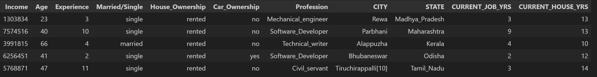

# India Loan Application Risk

Overview
In this project, we set out to produce a machine learning model trained to identify risky loan applications.  We obtained loan application data for 250,000 loan applicants in India, that contained a column for Risk Flag.  We cleaned and preprocessed the data, and trained a model that produced an accuracy of over 91% with the training data and nearly 89% with the testing data.

Analysis
The dataset contained data on 250,000 loan applications across the nation of India.  Well over 300 cities were represented in the dataset and around 30 states.  The applicants represented more than 50 different professions, with a wide range of annual incomes.  Other data included in the dataset were house ownership, rental, or neither, and number of years in the current home.  Applicants indicated their marital status as well as whether or not they owned a car, and how many years they had been in their current job, as well as years of experience.  Ages of applicants ranged from low 20s to nearly 70 years old.  The amount of the loan requested was not a field in the database. Finally, there was a risk-flag column indicating whether the loan was flagged as risky or not.  

A snippet of the data frame indicating the columns is shown below.

The numerical columns are described statistically below.

A Risk flag of 0 indicates a non-risky loan, and this column had an average of 0.123.  This indicates that only about 12.3 % of the loans were flagged as risky.

The data were preprocessed and encoded in different ways before being split into training and testing datasets.  Of the different iterations, it was found that the best results came from dropping the CITY data, and simply using the STATE data as the geographic information.  States with fewer than 2000 applications were aggregated into an OTHER state category to reduce the dimensionality of the data.  get_dummies was used to encode the Married/Single column, as well as the Car_Ownership and House_Ownership columns.  Since the Marital Status information and the Car_Ownership column were essentially defined with only one column, the married column, and the 'no car' column were dropped to further reduce dimensionality.  A standard scaler was used.

The training data were scaled and a deep learning neural net model was defined, compiled, and trained.  The resulting model was evaluated using the reserved test data.

The image below indicates some details of the neural net used for the iterative models.

Results
The iterations of different encoding schemes and preprocessing did not vary significantly.  Nor did tuning the model with keras tuner.  
Tuning with keras-tuner (Co Lab)

We achieved accuracy of around 89% for the testing data.

Project Proposal Document
https://docs.google.com/document/d/1oPRr9OlwbEjcbe5TWQCvG9sY_givHJHgWird6HvFv_w/edit

Dataset link
 https://www.kaggle.com/datasets/rohit265/loan-approval-dataset

Dataset citation
@misc{rohit_sharma_2024,
	title={Loan Approval Dataset},
	url={https://www.kaggle.com/dsv/8173310},
	DOI={10.34740/KAGGLE/DSV/8173310},
	publisher={Kaggle},
	author={Rohit Sharma},
	year={2024}}

google slides presentation link:  https://docs.google.com/presentation/d/1JhFLjekgvGiYlJfUr9gApWkLxA2UVvYeTIMuVFAt3LA/edit#slide=id.g2e36d07f5a6_0_5

Michael's ML model had the highest accuracy and lowest loss.  It is included in the notebooks folder.  It is titled Loan_approval4.ipynb.  Also included is a Model_Performance_Results Excel file.
